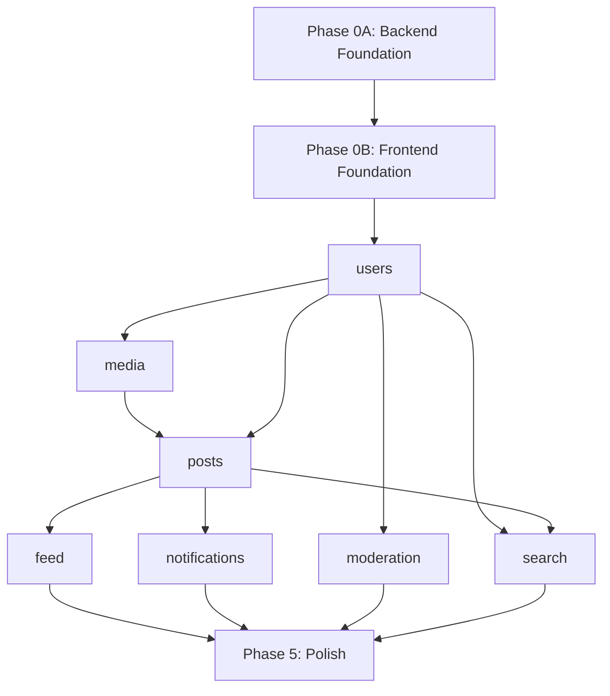

# Soapbox — Implementation Plan

This document is the single source of truth for what to build, in what order, and who is working on what. Claude Code must check this document before starting any module work.

## How to use this plan

1. Read this document before starting any work.
2. Find the next available module (status: `pending`, all dependencies marked `complete`).
3. Coordinate with your partner on Discord to claim the module.
4. Update the module status to `in progress` and add your name.
5. Work through the module's phases on a feature branch (`feat/<module-name>`).
6. When all phases are complete, mark the module as `complete` in this document.
7. Commit the status update, push the branch, and open a PR for review.
8. After merge, the next developer can start any module whose dependencies are now met.

> **If the only available modules depend on one that's in progress, work on bug fixes, test coverage, technical debt, or documentation instead. Do not start a module whose dependencies aren't complete.**

## Status legend

| Status | Meaning |
|--------|---------|
| `pending` | Not started, waiting for dependencies |
| `in progress` | Being actively worked on (see owner) |
| `in review` | PR open, awaiting review |
| `complete` | Merged to main |

---

## Phase 0: Project bootstrap

> Sequential. Must be completed before any module work begins.
> Branch: `phase/bootstrap`

### Phase 0A: Backend foundation
- [ ] Go module init (`go mod init`)
- [ ] Project directory structure (`cmd/`, `internal/core/`, `internal/<modules>/`, `build/`)
- [ ] Docker Compose for dev infra (Postgres, MinIO, Mailpit)
- [ ] Dockerfile + `entrypoint.sh` with APP_MODE pattern
- [ ] Shared DB package: connection pool, schema-per-module migration runner, transaction helpers
- [ ] Shared bus package: `Bus` interface + in-memory implementation (event + query)
- [ ] Shared registry package: `Registry` interface + in-memory implementation
- [ ] Shared cache package: `Cache` interface + in-memory implementation
- [ ] Shared HTTP package: router setup, response helpers, error formatting, pagination helpers
- [ ] Shared types package: ID types, timestamps, pagination params
- [ ] Module interface: `Load()` function contract that each module implements
- [ ] `cmd/web/main.go` composition root: init core services, start HTTP server
- [ ] Makefile targets: build, run, test, lint, docker-up, docker-down
- [ ] `.env.example` with all config vars
- [ ] Testing infrastructure: test helpers, database test utilities, bus test mocks
- [ ] Air config for hot reload

**Status:** `complete`
**Owner:** —
**Branch:** `phase/bootstrap`

### Phase 0B: Frontend foundation
- [ ] Vite + React + TypeScript project scaffold in `web/`
- [ ] Tailwind CSS setup
- [ ] shadcn/ui initialization and base components
- [ ] React Router setup with route structure (placeholder pages)
- [ ] TanStack Query provider setup
- [ ] Auth context (token storage, refresh logic, protected routes)
- [ ] Layout shell: nav bar, main content area, mobile-responsive sidebar
- [ ] API client module (base fetch wrapper, auth header injection, error handling)
- [ ] WebSocket client module (connection manager, reconnect logic — not connected to backend yet)
- [ ] Frontend testing infrastructure (Vitest, React Testing Library)
- [ ] Go `embed` integration: serve SPA from Go binary
- [ ] Proxy config for dev (Vite dev server → Go API)

**Status:** `complete`
**Owner:** —
**Branch:** `phase/bootstrap`

---

## Phase 1: Core module

### Module: users (auth + profiles + follows)
> Branch: `feat/users`
> Dependencies: Phase 0 complete

**Backend — auth:**
- [ ] `users` schema migrations (credentials, oauth_links, sessions, roles, profiles, follows)
- [ ] Seed admin role at migration time
- [ ] Registration endpoint (email + password, bcrypt hashing, creates profile in same transaction)
- [ ] Login endpoint (JWT access token + refresh token in httpOnly cookie)
- [ ] Refresh endpoint (token rotation)
- [ ] Logout endpoint (session invalidation)
- [ ] ~~OAuth flow (Google, GitHub, Apple)~~ — deferred to post-MVP
- [ ] JWT middleware (validate token, inject user context with role and verified status)
- [ ] Role-based middleware (moderator and admin route protection, hierarchy check)

**Backend — profiles & follows:**
- [ ] Get profile endpoint
- [ ] Update own profile endpoint (display name, bio, avatar URL)
- [ ] Follow / unfollow endpoints
- [ ] Followers / following list endpoints
- [ ] Publish `users.registered`, `users.followed`, `users.unfollowed`, `users.profile_updated` events
- [ ] Expose queries: `users.GetProfile`, `users.GetProfiles`, `users.GetFollowing`
- [ ] Search: username and display name search handler (for search module to query)
- [ ] Swagger annotations on all endpoints
- [ ] Unit and integration tests

**Frontend:**
- [ ] Login page
- [ ] Registration page
- [ ] ~~OAuth buttons~~ — deferred to post-MVP
- [ ] Auth state integration with app shell (logged in/out states, nav updates)
- [ ] Protected route wrapper using auth context
- [ ] Profile page (user info, posts tab, likes tab, followers/following lists)
- [ ] Profile edit / settings page
- [ ] Follow/unfollow button component
- [ ] User card component (reusable: search results, follower lists)
- [ ] Frontend tests

**Status:** `complete` (OAuth deferred to post-MVP)
**Owner:** Claude
**Branch:** `feat/users`

---

## Phase 2: Content modules (can be parallelized after Phase 1)

### Module: media
> Branch: `feat/media`
> Dependencies: users `complete`

**Backend:**
- [ ] `media` schema migrations (uploads)
- [ ] S3 client setup (MinIO for dev, S3 for prod, behind interface)
- [ ] Presigned upload URL endpoint
- [ ] Upload status tracking
- [ ] Expose queries: `media.GetUploadURL`, `media.GetByIDs`
- [ ] Swagger annotations on all endpoints
- [ ] Unit and integration tests

**Frontend:**
- [ ] Image upload component (drag-and-drop, preview, progress)
- [ ] Image display component (responsive, lazy loading)
- [ ] Frontend tests

**Status:** `complete`
**Owner:** Claude
**Branch:** `feat/media`

### Module: posts
> Branch: `feat/posts`
> Dependencies: users `complete`, media `complete`

**Backend:**
- [ ] `posts` schema migrations (posts with denormalized author fields, media, link_previews, hashtags, likes)
- [ ] Create post endpoint (text, images, link detection)
- [ ] Link preview fetching (extract title, description, image from URLs)
- [ ] Hashtag extraction and storage
- [ ] Delete post endpoint
- [ ] Like / unlike endpoints
- [ ] Repost / undo repost endpoints
- [ ] Get post endpoint
- [ ] Get replies (thread) endpoint
- [ ] Subscribe to `users.profile_updated` → update denormalized author data
- [ ] Publish `posts.created`, `posts.liked`, `posts.reposted`, `posts.deleted` events
- [ ] Expose queries: `posts.GetByIDs`, `posts.GetByAuthor`, `posts.GetThread`
- [ ] Search: full-text search on post body, hashtag matching handler
- [ ] Swagger annotations on all endpoints
- [ ] Unit and integration tests

**Frontend:**
- [ ] Post composer (text input with character count, image attachment, link preview)
- [ ] Post card component (author info, body, media, link preview, action buttons)
- [ ] Thread view (nested replies)
- [ ] Like / repost / share buttons with optimistic updates
- [ ] Post detail page
- [ ] Frontend tests

**Status:** `pending`
**Owner:** —

---

## Phase 3: Engagement modules (can be parallelized with each other)

### Module: feed
> Branch: `feat/feed`
> Dependencies: posts `complete`

**Backend:**
- [ ] `feed` schema migrations (timelines)
- [ ] Subscribe to `posts.created` → fan out to followers' timelines
- [ ] Subscribe to `users.followed` → backfill recent posts
- [ ] Subscribe to `posts.deleted` → remove from timelines
- [ ] Get timeline endpoint (chronological, cursor-based pagination)
- [ ] Consume queries: `posts.GetByIDs`, `users.GetFollowing`
- [ ] Expose queries: `feed.GetTimeline`
- [ ] WebSocket: implement server-side "N new posts" push
- [ ] Swagger annotations on all endpoints
- [ ] Unit and integration tests

**Frontend:**
- [ ] Home page / timeline feed
- [ ] "N new posts" banner (click to load)
- [ ] Infinite scroll with cursor pagination
- [ ] WebSocket integration for real-time new post indicator
- [ ] Frontend tests

**Status:** `pending`
**Owner:** —

### Module: notifications
> Branch: `feat/notifications`
> Dependencies: posts `complete`

**Backend:**
- [ ] `notifications` schema migrations
- [ ] Subscribe to `posts.liked` → notify post author
- [ ] Subscribe to `posts.reposted` → notify post author
- [ ] Subscribe to `posts.created` (replies) → notify parent post author
- [ ] Subscribe to `users.followed` → notify followed user
- [ ] Get notifications endpoint (paginated)
- [ ] Mark as read / mark all as read endpoints
- [ ] Publish `notifications.new` event
- [ ] WebSocket: push `new_notification` event to connected clients
- [ ] Consume queries: `moderation.GetBlockList`, `moderation.GetMuteList` (filter notifications from blocked/muted users) — **if moderation is complete, otherwise defer filtering to a follow-up**
- [ ] Swagger annotations on all endpoints
- [ ] Unit and integration tests

**Frontend:**
- [ ] Notifications page (activity feed, grouped by type)
- [ ] Notification badge in nav bar
- [ ] WebSocket integration for real-time badge updates
- [ ] Mark as read interactions
- [ ] Frontend tests

**Status:** `pending`
**Owner:** —

---

## Phase 4: Safety and discovery modules (can be parallelized with each other)

### Module: moderation
> Branch: `feat/moderation`
> Dependencies: users `complete`

**Backend:**
- [ ] `moderation` schema migrations (reports, blocks, mutes)
- [ ] Block / unblock endpoints
- [ ] Mute / unmute endpoints
- [ ] Report endpoint (user or post)
- [ ] Moderator endpoints: list reports, resolve report, delete any post, temp suspend user (requires moderator role)
- [ ] Admin endpoints: ban/unban user, promote/demote moderator, set/unset verified flag (requires admin role)
- [ ] Role-based middleware checks (moderator vs admin tier)
- [ ] Expose queries: `moderation.GetBlockList`, `moderation.GetMuteList`
- [ ] Swagger annotations on all endpoints
- [ ] Unit and integration tests

**Frontend:**
- [ ] Block / mute buttons on user profiles and post cards
- [ ] Report modal
- [ ] Blocked / muted users list in settings
- [ ] Moderator panel: report review queue, content moderation actions
- [ ] Admin panel: user management (ban, promote/demote, verify), visible only to admins
- [ ] Frontend tests

**Status:** `pending`
**Owner:** —

### Module: search
> Branch: `feat/search`
> Dependencies: posts `complete`, users `complete`

**Backend:**
- [ ] Search orchestration: receive query, fan out to posts and users via bus, aggregate results
- [ ] `/search` endpoint with `type` parameter routing
- [ ] Consume queries: `moderation.GetBlockList`, `moderation.GetMuteList` (filter results) — **if moderation is complete, otherwise defer filtering**
- [ ] Postgres full-text search indexes on posts.body and users.username/display_name
- [ ] Swagger annotations on all endpoints
- [ ] Unit and integration tests

**Frontend:**
- [ ] Search page with tabs (posts, users, hashtags)
- [ ] Search bar in nav (with debounced input)
- [ ] Frontend tests

**Status:** `pending`
**Owner:** —

---

## Phase 5: Integration and polish

> Branch: `phase/polish`
> Dependencies: all modules `complete`

- [ ] Block/mute filtering wired up across all modules (feed, notifications, search) if not already done
- [ ] End-to-end testing across module boundaries
- [ ] Performance testing (feed rendering, search response times)
- [ ] Mobile responsiveness audit
- [ ] Error handling audit (consistent error responses, user-friendly messages)
- [ ] Security audit (CORS, rate limiting, input sanitization, XSS prevention)
- [ ] Production Docker Compose / deployment config
- [ ] README with setup and contribution instructions
- [ ] Final consistency pass: naming, patterns, dead code

**Status:** `pending`
**Owner:** —

---

## Module dependency graph

## Parallelization windows

After the sequential foundation (Phase 0 → users), work fans out:

| Window | Developer A | Developer B |
|--------|-------------|-------------|
| Phase 2 | media → posts | moderation (or bug fixes/debt if waiting) |
| Phase 3 | feed | notifications |
| Phase 4 | search | bug fixes / debt cleanup / moderation filtering |
| Phase 5 | Integration and polish (together) | Integration and polish (together) |
