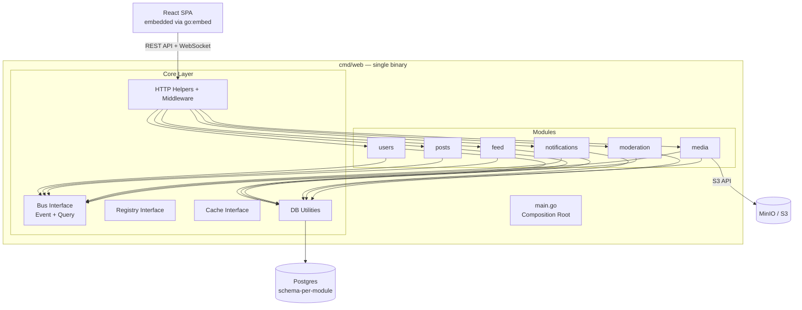

# Soapbox — Design Specification

A Twitter clone with pre-2022 feel. Chronological feed, no algorithmic manipulation, clean and focused. Built as a modular monolith designed to scale into microservices when needed.

## Goals

- Build a usable social microblogging platform for thousands of users
- Chronological, ad-free experience inspired by pre-2022 Twitter
- Modular architecture where each domain is self-contained and independently deployable
- Start on a single VPS, designed to migrate to cloud infrastructure when needed
- Mobile-first responsive web, with a Flutter native app planned post-MVP

## MVP features

- **Posts:** text + images + link previews (280 character limit)
- **Feed:** chronological timeline from followed users, "N new posts" click-to-load indicator
- **Social:** follow, like, repost, share
- **Threads/replies:** nested conversations under posts
- **Hashtags:** searchable via the search endpoint (no dedicated browse page — that's post-MVP with trending)
- **Notifications:** in-app (like, repost, reply, follow)
- **User profiles:** username, display name, bio, avatar
- **Search:** posts, users, hashtags
- **Moderation:** block, mute, report (manual review)
- **Auth:** email+password + OAuth (Google, GitHub, Apple), role-based access (moderator and admin roles) — handled within the users module
- **Identity verification:** verified flag on profiles, planned login.gov integration post-MVP
- **Admin/mod UI:** role-gated within the SPA — moderators see report review and content moderation, admins see user management (ban, promote/demote) plus everything moderators see
- **Mobile-first responsive web UI**

## Post-MVP features

- Direct messages
- Category-based feed curation (users pick interests)
- Trending/explore page
- Automated moderation (spam filters)
- Community notes (crowd-sourced fact-checking)
- Flutter native app
- Redis for distributed service registry with TTL-based heartbeat
- Redis for application cache
- RabbitMQ/Kafka for distributed event bus
- Graceful degradation and circuit breakers for cross-service queries
- Separate SPA container (decoupled from Go binary)

## Tech stack

| Layer | Technology |
|-------|-----------|
| Backend | Go (modular monolith), chi, sqlx, pgx, goose |
| Frontend | React + Vite + shadcn/ui + Tailwind CSS |
| State management | TanStack Query (server state) + React built-ins (client state) |
| Database | PostgreSQL 16 (schema-per-module) |
| Object storage | S3-compatible (MinIO for dev, AWS S3 or equivalent for prod) |
| Dev email | Mailpit |
| Dev infra | Docker Compose |

## System architecture



### Dependency rule

`cmd/ → modules → core/`. Modules never import each other. Modules never import upward into `cmd/`.

### Project structure

```
soapbox/
├── cmd/
│   └── web/
│       └── main.go              # Wires all modules (only entry point for now)
├── internal/
│   ├── core/
│   │   ├── bus/                 # Bus interface + in-memory implementation
│   │   ├── registry/            # Registry interface + in-memory implementation
│   │   ├── cache/               # Cache interface + in-memory implementation
│   │   ├── db/                  # sqlx connection, migration runner, transaction helpers
│   │   ├── httpkit/             # Response writers, error formatting, pagination, middleware
│   │   └── types/               # Common types (IDs, timestamps, pagination params)
│   ├── users/                 # Auth + profiles + follows
│   ├── posts/
│   ├── feed/
│   ├── notifications/
│   ├── media/
│   └── moderation/
├── web/                          # React SPA (Vite project)
├── build/
│   ├── Dockerfile                # Builds all cmd/ binaries into one image
│   └── entrypoint.sh             # Reads APP_MODE, runs the right binary
├── docker-compose.yml            # Dev infra: Postgres, MinIO, Mailpit
└── deploy/                       # Production deployment configs
```

### Composition root

The `cmd/web/main.go` is a thin wiring layer. It initializes core infrastructure and loads modules:

```go
func main() {
    core.Init() // DB, bus, registry, cache, config, HTTP server

    users.Load()
    posts.Load()
    feed.Load()
    notifications.Load()
    media.Load()
    moderation.Load()

    core.Start() // Starts the HTTP server
}
```

Add a module: add one line. Remove a module: delete one line.

### APP_MODE pattern

Single Docker image containing all binaries. `entrypoint.sh` reads `APP_MODE` to determine which binary to run:

```bash
APP_MODE=${APP_MODE:-web}

case "$APP_MODE" in
    web)     exec /app/bin/web ;;
    # Future entry points:
    # admin)   exec /app/bin/admin ;;
    # content) exec /app/bin/content ;;
    *)       echo "Unknown APP_MODE: $APP_MODE"; exit 1 ;;
esac
```

For now only `cmd/web/` exists. Future entry points (e.g., `cmd/admin/`, `cmd/content/`) load different module subsets from the same codebase.

## Communication layer

The core layer provides abstracted interfaces for all inter-module communication. Modules only interact with interfaces, never implementations. Swapping an implementation is a one-line change in `main.go`.

### Bus interface

```go
type Bus interface {
    // Async — fire-and-forget, zero or many subscribers
    Publish(topic string, event any) error
    Subscribe(topic string, handler func(event any)) error

    // Sync — request-response
    RegisterQuery(name string, handler func(req any) (any, error)) error
    Query(name string, req any) (any, error)
}
```

### Registry interface

```go
type Registry interface {
    Register(module string, queries []string) error
    Lookup(query string) (Handler, error)
    Deregister(module string) error
}
```

### Cache interface

```go
type Cache interface {
    Get(key string, dest any) error
    Set(key string, value any, ttl time.Duration) error
    Delete(key string) error
}
```

### MVP implementations

All three use in-memory implementations:

- `bus.NewInProcessBus()` — Go channels + goroutines for events, direct function dispatch for queries
- `registry.NewMemoryRegistry()` — map of query names to handlers
- `cache.NewMemoryCache()` — sync.Map with TTL-based expiration

### Future swap path

| Interface | MVP | Future |
|-----------|-----|--------|
| Bus | In-memory | RabbitMQ → Kafka |
| Registry | In-memory map | Redis with 30s TTL heartbeat → Consul |
| Cache | In-memory | Redis |

Modules are opaque to these swaps. They call `bus.Publish()`, `registry.Lookup()`, `cache.Get()` and never know what's behind the interface.

## Data model

Single Postgres instance. Each module owns its own schema. No cross-schema foreign keys. Modules reference each other by ID only, enforced at the application level through the bus.

### users schema

| Table | Columns |
|-------|---------|
| `users.credentials` | id, user_id, email, password_hash, created_at |
| `users.oauth_links` | id, user_id, provider, provider_id, created_at |
| `users.sessions` | id, user_id, refresh_token, expires_at, created_at |
| `users.roles` | id, user_id, role, created_at |
| `users.profiles` | id, username, display_name, bio, avatar_url, verified, created_at |
| `users.follows` | follower_id, following_id, created_at |

Roles follow a simple hierarchy: (default user) < moderator < admin. Users with no role row are regular users. The admin role is seeded at database initialization. Moderators are promoted by admins via the API. The JWT payload includes the user's role and verified status for frontend and backend authorization checks. Registration creates credentials and a default profile in a single transaction.

The `verified` flag on profiles indicates identity verification (planned login.gov integration post-MVP). Verification is orthogonal to roles — a moderator or admin can also be verified. For MVP, admins can manually set the verified flag.

### posts schema

| Table | Columns |
|-------|---------|
| `posts.posts` | id, author_id, author_username, author_display_name, author_avatar_url, author_verified, body, parent_id, repost_of_id, created_at |
| `posts.media` | id, post_id, media_url, media_type, position |
| `posts.link_previews` | id, post_id, url, title, description, image_url |
| `posts.hashtags` | post_id, tag |
| `posts.likes` | post_id, user_id, created_at |

### feed schema

| Table | Columns |
|-------|---------|
| `feed.timelines` | user_id, post_id, created_at |

### notifications schema

| Table | Columns |
|-------|---------|
| `notifications.notifications` | id, user_id, type, actor_id, post_id, read, created_at |

### media schema

| Table | Columns |
|-------|---------|
| `media.uploads` | id, user_id, file_key, content_type, size, status, created_at |

### moderation schema

| Table | Columns |
|-------|---------|
| `moderation.reports` | id, reporter_id, target_type, target_id, reason, status, created_at |
| `moderation.blocks` | user_id, blocked_user_id |
| `moderation.mutes` | user_id, muted_user_id |

## Module event and query map

### users

- **Publishes:** `users.registered`, `users.followed`, `users.unfollowed`, `users.profile_updated`
- **Queries exposed:** `users.GetProfile`, `users.GetProfiles`, `users.GetFollowing`

### posts

- **Subscribes:** `users.profile_updated` → updates denormalized author data (username, display name, avatar, verified) across all posts by that user
- **Publishes:** `posts.created`, `posts.liked`, `posts.reposted`, `posts.deleted`
- **Queries exposed:** `posts.GetByIDs`, `posts.GetByAuthor`, `posts.GetThread`

**Denormalization:** Posts store a snapshot of author data (username, display_name, avatar_url, verified) at creation time. This eliminates cross-module queries when rendering feeds. Author data is kept in sync via the `users.profile_updated` event.

### feed

- **Subscribes:** `posts.created` → adds to followers' timelines, `users.followed` → backfill recent posts, `posts.deleted` → removes from timelines
- **Queries exposed:** `feed.GetTimeline`
- **Queries consumed:** `posts.GetByIDs`, `users.GetFollowing`

### notifications

- **Subscribes:** `posts.liked`, `posts.reposted`, `posts.created` (replies), `users.followed`
- **Publishes:** `notifications.new` (triggers WebSocket push)
- **Queries exposed:** `notifications.GetForUser`

### media

- **Queries exposed:** `media.GetUploadURL`, `media.GetByIDs`

### moderation

- **Queries exposed:** `moderation.GetBlockList`, `moderation.GetMuteList`
- **Queries consumed by:** feed (filter timeline), posts (filter replies), notifications (filter), search (filter results)

### search

Search is a thin orchestration module that owns the `/search` endpoint. It fans out queries to posts and users modules via the bus, aggregates results, and returns them. It owns no data itself. Each module handles search for its own domain:
- Posts module: full-text search on post body, hashtag matching
- Users module: search by username and display name

The search interface is abstract enough to swap Postgres full-text for OpenSearch later without changing the data-owning modules.

## API design

REST API under `/api/v1/`. All responses are JSON. Auth via JWT in the `Authorization` header. Cursor-based pagination using `?cursor=&limit=` on list endpoints.

**Swagger:** Every endpoint handler must include `swaggo/swag` annotations (`@Summary`, `@Description`, `@Tags`, `@Param`, `@Success`, `@Failure`, `@Router`). Run `make swagger` to regenerate. Swagger UI is served at `/swagger/index.html`.

### users (auth + profiles + follows)

| Method | Endpoint | Description |
|--------|----------|-------------|
| POST | `/auth/register` | Register with email+password (creates credentials + profile) |
| POST | `/auth/login` | Login, returns JWT + refresh token |
| POST | `/auth/refresh` | Refresh access token |
| POST | `/auth/oauth/:provider` | OAuth login/register |
| POST | `/auth/logout` | Invalidate session |
| GET | `/users/:username` | Get user profile |
| PUT | `/users/me` | Update own profile |
| POST | `/users/:username/follow` | Follow user |
| DELETE | `/users/:username/follow` | Unfollow user |
| GET | `/users/:username/followers` | List followers |
| GET | `/users/:username/following` | List following |

### posts

| Method | Endpoint | Description |
|--------|----------|-------------|
| POST | `/posts` | Create post (or reply via parent_id) |
| GET | `/posts/:id` | Get single post |
| DELETE | `/posts/:id` | Delete own post |
| POST | `/posts/:id/like` | Like post |
| DELETE | `/posts/:id/like` | Unlike post |
| POST | `/posts/:id/repost` | Repost |
| DELETE | `/posts/:id/repost` | Undo repost |
| GET | `/posts/:id/replies` | Get reply thread |

### feed

| Method | Endpoint | Description |
|--------|----------|-------------|
| GET | `/feed` | Chronological timeline (paginated) |

### notifications

| Method | Endpoint | Description |
|--------|----------|-------------|
| GET | `/notifications` | List notifications (paginated) |
| PUT | `/notifications/:id/read` | Mark as read |
| PUT | `/notifications/read-all` | Mark all as read |

### media

| Method | Endpoint | Description |
|--------|----------|-------------|
| POST | `/media/upload-url` | Get presigned S3 upload URL |

### moderation

| Method | Endpoint | Description |
|--------|----------|-------------|
| POST | `/reports` | Report a user or post |
| POST | `/users/:username/block` | Block user |
| DELETE | `/users/:username/block` | Unblock user |
| POST | `/users/:username/mute` | Mute user |
| DELETE | `/users/:username/mute` | Unmute user |

### admin (requires moderator or admin role)

| Method | Endpoint | Description | Min role |
|--------|----------|-------------|----------|
| GET | `/admin/reports` | List pending reports (paginated) | moderator |
| PUT | `/admin/reports/:id` | Resolve report (dismiss, warn) | moderator |
| DELETE | `/admin/posts/:id` | Delete any post | moderator |
| POST | `/admin/users/:username/suspend` | Temporarily suspend user | moderator |
| POST | `/admin/users/:username/ban` | Ban user | admin |
| DELETE | `/admin/users/:username/ban` | Unban user | admin |
| PUT | `/admin/users/:username/role` | Promote/demote to moderator | admin |
| PUT | `/admin/users/:username/verify` | Set/unset verified flag | admin |

### search

| Method | Endpoint | Description |
|--------|----------|-------------|
| GET | `/search?q=&type=posts\|users\|hashtags` | Search |

### WebSocket

| Endpoint | Description |
|----------|-------------|
| WS `/ws` | Single persistent connection. Authenticated via access token as a query parameter on connection. Server pushes `new_posts(count)` and `new_notification` events. |

## Auth flow

### Email + password

- Passwords hashed with bcrypt
- JWT access tokens (short-lived, ~15 min) + refresh tokens (longer-lived, stored in `users.sessions`). JWT payload includes role and verified status.
- Refresh token rotation — each use issues a new refresh token and invalidates the old one

### OAuth

- Google, GitHub, Apple via standard OAuth2 flow
- First OAuth login creates a user profile automatically
- Links OAuth to existing account if email matches

### Session management

- Access token held in memory (JS variable)
- Refresh token in httpOnly cookie
- Shared middleware validates JWT on every API request and injects user context

## Frontend

### Stack

React + Vite + shadcn/ui + Tailwind CSS. TanStack Query for server state. React built-ins (`useState`, `useContext`) for client state.

### Embedded SPA

The built React app is embedded into the Go binary via `go:embed`. The Go server serves the SPA's static files alongside the API. Single deployment artifact.

The SPA is a fully independent Vite build that only communicates via `/api/v1/*` endpoints. It can be extracted into its own container (served by nginx) with zero code changes to frontend or backend — only deployment config changes.

### Pages

- **Home** — chronological timeline feed with "N new posts" indicator
- **Profile** — user's posts, likes, followers/following lists
- **Post detail** — thread view with nested replies
- **Search results** — posts, users, hashtags tabs
- **Notifications** — activity feed
- **Settings** — profile edit, account management, blocked/muted users
- **Admin** — moderators see report review queue and content moderation actions. Admins additionally see user management (ban, promote/demote, verify). Role-gated visibility.
- **Auth** — login, register, OAuth

### WebSocket

Single persistent connection from the client. The server pushes lightweight events:
- `new_posts_available { count }` — shows "N new posts" banner, user clicks to load
- `new_notification { type, preview }` — updates notification badge/indicator

## Dev infrastructure

Docker Compose for local development services. The Go app runs outside Docker during development, pointed at these services via environment variables.

```yaml
services:
  postgres:
    image: postgres:16
    ports:
      - "5432:5432"
    environment:
      POSTGRES_DB: soapbox
      POSTGRES_USER: soapbox
      POSTGRES_PASSWORD: soapbox

  minio:
    image: minio/minio
    ports:
      - "9000:9000"
      - "9001:9001"  # Console
    command: server /data --console-address ":9001"

  mailpit:
    image: axllent/mailpit
    ports:
      - "1025:1025"  # SMTP
      - "8025:8025"  # Web UI
```

## Collaborative development workflow

Soapbox is built collaboratively by two developers, each using Claude Code.

### Module ownership rules

- **Modules never import each other.** All communication goes through the bus (events or queries).
- **Publisher owns the event contract.** The module that publishes an event defines its schema. Consumers subscribe to it as-is.
- **No cross-module code changes.** When working on a module, you must not modify another module's code. If you need something from another module, it must be exposed via the bus.

### Build order

The phased plan encodes module dependencies explicitly. A module cannot be started until all modules it depends on (subscribes to or queries from) are marked complete. Claude Code must check the plan document before starting any module work. If the only available modules depend on one currently in progress by the other developer, the blocked developer works on bug fixes, tests, or technical debt cleanup.

### Coordination

- The plan document (`docs/plan.md`) is the single source of truth for module status.
- When a module's phases are complete, Claude marks it as complete in the plan doc before pushing the branch.
- Module status merges with the code — no separate tracking step.
- Developers communicate module ownership through Discord (future: Jira board).
- Merge conflicts on the plan doc are resolved like any code conflict.

### Code review process

- Each module is developed on its own feature branch.
- Branch is pushed and a PR is opened for review before merging to main.
- Reviews focus on: consistency with design principles, module boundary violations, event contract correctness.
- Either developer or Copilot review can review. The author's Claude Code session pulls PR comments, evaluates them, fixes if warranted, and resolves.

## Future concerns (documented, not solved)

- **Graceful degradation:** When modules are split into separate services, sync queries may fail between a module going down and the registry TTL expiring (~30s). Circuit breakers and fallback strategies needed.
- **Distributed registry:** Move from in-memory to Redis-backed registry with TTL heartbeat when services are split across hosts.
- **Event ordering:** In-memory bus preserves order. Distributed bus (RabbitMQ/Kafka) may need partition keys to maintain per-user event ordering.
- **Rate limiting:** Per-user and per-endpoint rate limiting at the HTTP middleware layer.
- **Media processing:** Image resizing, format conversion, thumbnail generation. Can be handled in the media module or offloaded to a background worker.
